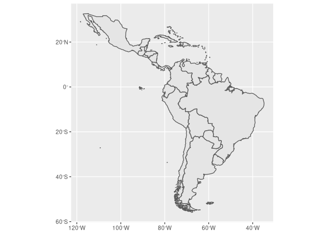
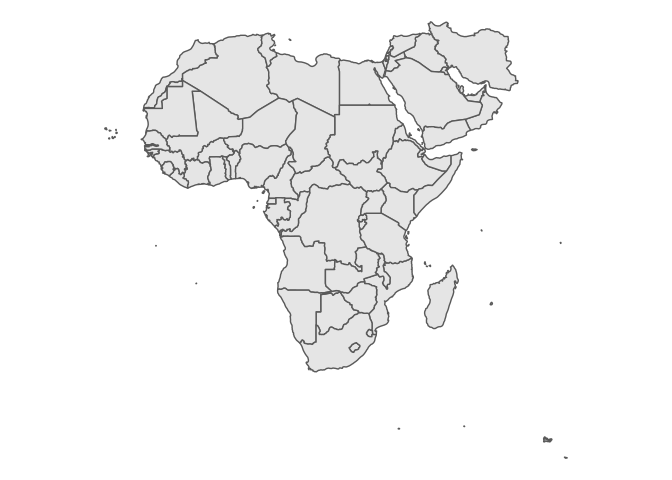

<!-- README.md is generated from README.Rmd. Please edit that file -->

# misc

<!-- badges: start -->

[](https://travis-ci.com/kguidonimartins/misc)
<!-- badges: end -->

`{misc}` stands for *miscellaneous*. This is a personal package. Use it
at your own risk.

## Installation

You can install the released version of misc from
[github](https://github.com/kguidonimartins/misc) with:

``` r
if (!require("remotes")) install.packages("remotes")
if (!require("misc")) remotes::install_github("kguidonimartins/misc")
```

### Available functions

| ID | Function                          | Description                                                   |
| -: | :-------------------------------- | :------------------------------------------------------------ |
|  1 | `create_dirs()`                   | Create data, output and R directories                         |
|  2 | `describe_data()`                 | Describe data                                                 |
|  3 | `ipak()`                          | Install and load multiple R packages                          |
|  4 | `na_count()`                      | Count NA frequency in data                                    |
|  5 | `na_viz()`                        | Vizualize NA frequency in data                                |
|  7 | `prefer()`                        | Defines preferred functions from conflicts between namespaces |
|  8 | `quick_map()`                     | Create maps quickly                                           |
|  9 | `read_all_sheets_then_save_csv()` | Read and save into csv files all the sheets in a excel file   |
| 10 | `read_all_xlsx_then_save_csv()`   | Read all sheets from all excel files and save into csv files  |
| 11 | `read_sheet_then_save_csv()`      | Read a excel sheet and save into a csv file                   |
| 12 | `save_temp_data()`                | Save objects as a RDS file                                    |

### Usage

``` r
library(misc)

# install and load multiple packages
ipak(c("vegan", "dplyr"))

# create world map quickly
quick_map()
```


``` r

# create other maps quickly
quick_map(region = "South America", type = "sf")
```


``` r
quick_map(region = "Caribbean", type = "sf")
```



``` r

# edit maps
if (!require("ggplot2")) install.packages("ggplot2")
quick_map(region = "Africa", type = "sf") +
  theme_void()
```



### What commit is this file at?

``` r
if ("git2r" %in% installed.packages() & git2r::in_repository(path = ".")) git2r::repository(here::here())
#> Local:    main /home/karlo/GoogleDrive2/git-repos/misc
#> Remote:   main @ origin (https://github.com/kguidonimartins/misc.git)
#> Head:     [05ff493] 2020-07-31: add `describe_data()`
```
