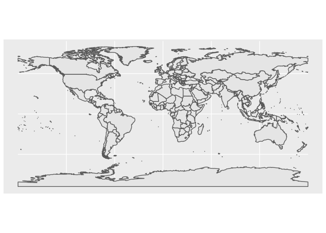
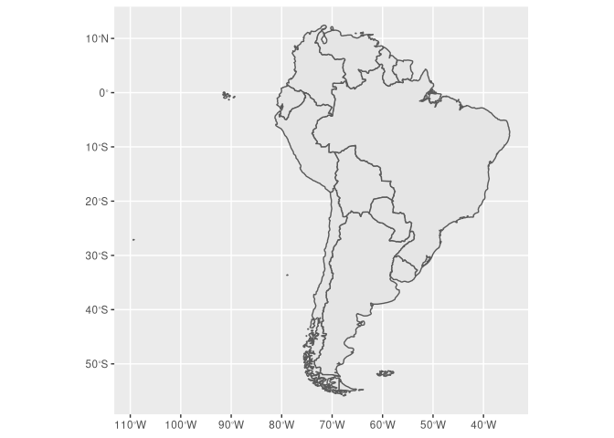
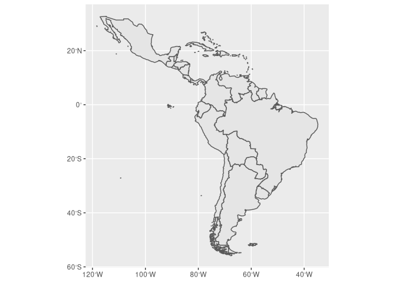

<!-- README.md is generated from README.Rmd. Please edit that file -->

# misc

<!-- badges: start -->

[](https://travis-ci.com/kguidonimartins/misc)
<!-- badges: end -->

`{misc}` stands for *miscellaneous*. This is a personal package. Use it
at your own risk.

## Installation

You can install the released version of misc from
[github](https://github.com/kguidonimartins/misc) with:

``` r
if (!require("remotes")) install.packages("remotes")
if (!require("misc")) remotes::install_github("kguidonimartins/misc")
```

### Usage

``` r
library(misc)

# install and load multiple packages
ipak(c("vegan", "dplyr"))

# create world map quickly
quick_map()
```



``` r

# create other maps quickly
quick_map(region = "South America", type = "sf")
```



``` r
quick_map(region = "Caribbean", type = "sf")
```



``` r

# edit maps
if (!require("ggplot2")) install.packages("ggplot2")
quick_map(region = "Africa", type = "sf") +
  theme_void()
```


